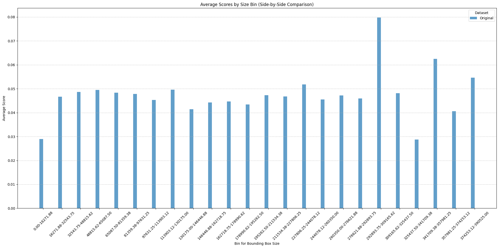
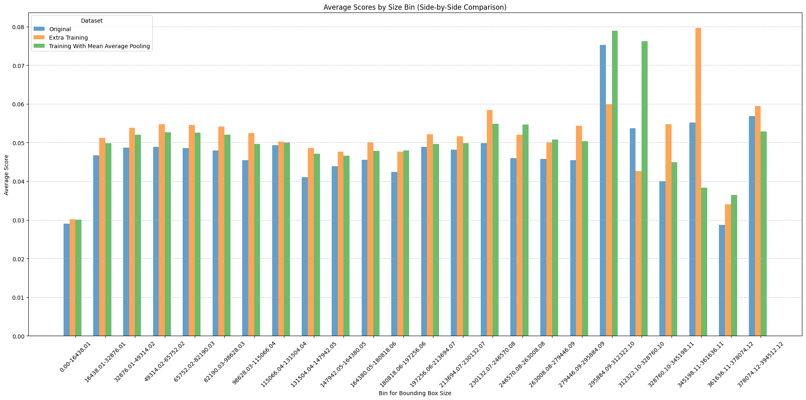

# README for YOLOv7 Small Bounding Box Detection

## 1. Candidate Papers

1. **YOLOv7: Trainable bag-of-freebies sets new state-of-the-art for real-time object detectors**  
   This was the only paper that I considered, I was interested in becoming more familiar with real-time object detectors and their potential application to robotics. I know there are several versions of YOLO, but this version came out in 2022 which is fairly recent, and included a nice repository implemented in Pytorch (a machine learning library I was familiar with) which I was able to fork and begin working on directly.

## 2. Execution Steps

### 2.1 Setup

Clone the [https://github.com/Isaacwilliam4/yolov7](fork of YoloV7 I have)  and install the necessary dependencies:

```bash
cd yolov7/
pip install -r requirements.txt
```

### 2.2 Training the Model

Use the following command to start training the model on the COCO dataset:

```bash
python3 train.py --workers 8 --device 0 --batch-size 32 --data data/coco.yaml --img 640 --cfg cfg/training/yolov7.yaml --weights '' --name yolo_extra_training --hyp data/hyp.scratch.p5.yaml --epochs 25
```

This command will train the model on the COCO dataset with the specified parameters. If the dataset is not found, it will download it for you. Make sure to update the .yaml file located at `/data/coco.yaml` so that it references whichever coco dataset you want. For implementing the different experiments, I would copy the coco dataset, apply the function to add the small images, and then reference the new dataset in the `/data/coco.yaml` in order to get results.

### 2.3 Notebooks

The project includes several Jupyter notebooks for easier exploration:

- **notebooks/mean_avg_pooling.ipynb**  
   This notebook demonstrates the image shrinking method using mean average pooling and ensures that the corresponding bounding box labels are still valid after shrinking.

- **notebooks/size_dist.ipynb**  
   This notebook analyzes the effect of applying the shrinking method to the COCO dataset and presents the resulting confidence scores for bounding boxes of different sizes.

- **notebooks/add_small_images.ipynb**  
   This notebook provides functions to shrink images, add them to the dataset, and update the labels accordingly.

## 3. Execution Time

Training the model for 25 epochs on the COCO dataset took approximately **12 hours**, with each epoch taking about **30 minutes**. The time may vary depending on the machine's hardware.

For adding small images, the time to update the dataset and labels depends on the number of small images added. However, the core functionality is designed to be fast and efficient.

## 4. Code Summary and Testing

The core of the code involves modifying the YOLOv7 model to increase confidence in detecting small bounding boxes. The key functions include:

- **Image Shrinking**: This function applies mean average pooling (kernel size = 2) to reduce image size and increase the model’s focus on small objects.

\[
\begin{bmatrix}
0.25 & 0.25 \\
0.25 & 0.25
\end{bmatrix}
\]

- **Label Update**: After shrinking the images, the corresponding bounding box labels are resized to match the new image dimensions.
  
Test cases are based on the comparison of model performance before and after modifying the dataset by adding small images. The performance is evaluated based on the confidence scores for bounding boxes of different sizes.

### 4.1 External Packages

All the necessary packages can be found in yolov7/requirements.txt in order to install them simply run

```
pip install -r requirements.txt
```

## 5. Improvements

The key improvement in this project was the addition of small images to the dataset, aimed at increasing the model's ability to detect smaller bounding boxes. By shrinking the images to a threshold size, I hoped to force the model to focus more on small objects, thereby improving confidence in predictions for these items.

Additionally, I implemented mean average pooling to reduce image size, preserving important features while making the bounding boxes smaller. This technique was applied selectively based on bounding box size.

## 6. Changes

### 6.1

The primary changes to the original YOLOv7 algorithm include:

- **Image Shrinking Function**: A new function was introduced to reduce the size of images until their average bounding box size fell below a threshold, aimed at increasing detection accuracy for smaller objects.
- **Dataset Modification**: 30,000 small images were added to the training set, and corresponding bounding box labels were adjusted accordingly.
  
These changes are implemented in the **notebooks/add_small_images.ipynb** file and the main training script.

### 6.2 
I ran a total of three different experiments with the yolov7 model each for 25 epochs.

- Original Experiment: This experiment was run on the original coco dataset with no modifications. This was to establish a baseline for the performance of YOLOv7 after 25 epochs.
- Experiment with Average Pooling: For this experiment I added the smaller images with the threshold of 16,271 $p^2$, ($p^2 = l*w$ in pixels) for the average bounding box size. We added a total of 30,000 small images to the dataset
- Experiment with extra training: It’s well known that models perform better with extra training, so in order to offset the extra training performed by the 30,000 added smaller images, we added the same images - without shrinking them - to another dataset and trained the model on that to get a better comparison. 

## 7. Data Structures

I used basic data structures like arrays and lists to store the bounding box areas and confidence scores. The COCO dataset’s JSON format was used to store labels, and custom structures were built to handle the resizing of images and bounding boxes.

## 8. Original Algorithm Results

The original YOLOv7 algorithm was trained on the standard COCO dataset for 25 epochs. The performance was evaluated based on the confidence in the model on different sized bounding boxes.



## 9. Modified Algorithm Results

The following graph shows the results between the different experiments.



## 10. Comparison

The increased amount of smaller images via mean average pooling did not seem to increase model confidence more than that of the experiment that just did extra training. Strangely enough, adding the smaller images to the training dataset did increase the models confidence in some of the larger bounding box categories, one hypothesis for why this could be the case is that by training on smaller images of one class, the model is more confident on that class when it is larger.  

## 11. Implementation Analysis

The `create_small_images()` function  effectively applied the mean average pooling to decrease the image size and update the training dataset and training labels effectively. However, doing so did not seem to increase the model confidence in smaller image sizes. 

The function has $O(n)$ complexity with respect to the number of images that you want to add to the training dataset. 

The `shrink_images()` function complexity is dependent on the kernel size ($k$), the  average bounding box size ($\mu$) of the original image, and the desired bounding box size ($\mu'$). Given these parameters the complexity would be

$O(log_k(\mu - \mu'))$

## 13. Data and Outputs

All images and output plots are included in the project repository. You can find the training images, predictions, and histograms in the **notebooks** directory. The images used for training, as well as the plots generated for comparison, can be accessed and downloaded directly. For downloading the coco dataset, the training script provided in the [Training the model](#22-Training-the-Model) will automatically download the coco dataset for you if it doesn't recognize it.

## 14. Challenges

- **Training Time**: Training the model for 25 epochs took a long time (approximately 12 hours), especially with the added small images. This was by far the largest constraint as it made any analysis I wanted to perform very time critical.
- **Memory Constraints**: I did have access to a NVIDIA 4090 GPU, which allowed me to train sufficiently fast, but it still was not enough to get results as specified in the paper with many more epochs.

